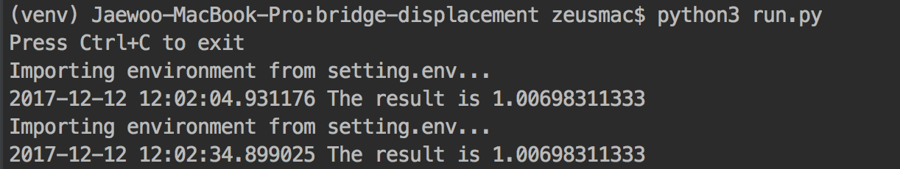

# Bride-displacement detection

Program that collects the motion information of bridge and measures the position changed distance, based on the reference value. You can go to the [pre-test](https://github.com/zaiyou12/til/blob/master/scikit-image/Practical%20Test.ipynb) to see visualized result and test if the image change.

교량의 움직임 정보를 수집하여 절대값을 기준으로 위치 변화된 거리를 측정하는 프로그램. [사전 테스트 페이지](https://github.com/zaiyou12/til/blob/master/scikit-image/Practical%20Test.ipynb)로 가서 시각화된 결과를 볼수 있고, 이미지가 달라졌을시 사전에 테스트 할수 있습니다.

This program is executed once every hour and the result is stored in oracle DB.

위 프로그램은 한 시간마다 한 번씩 실행되고, 결괏값은 oracle DB로 저장합니다. (현재는 테스트를 위해 30초마다 1회 실행되며, 결과값은 출력합니다.)

## Requirements

Install requirements using:

```bash
pip install -r requirements.txt
```

## Setting variables

You can modify the variable in `setting.env` to fit the image.

- `file_url`: Image file path. Automatically fetches and analyzes the lastest file every hour.
- `db_path`: Oracle DB path.
- `refernce_distance`: Distance between first two points.
- `x1_start, x1_end`: X coordinate range point of point 1. To recognize an image as a matrix, the x-coordinate is calculated from the top-left of the picture to the bottom left. If the range is too large, the result may be inaccurate.
- `y1_start, y1_end`: Y coordinate range point of point 1. The y-coordinate is calculated from the top-left of the picture to the top-right. Also, if the range is too large, the result may be inaccurate.

## Getting started

```bash
python run.py
```


